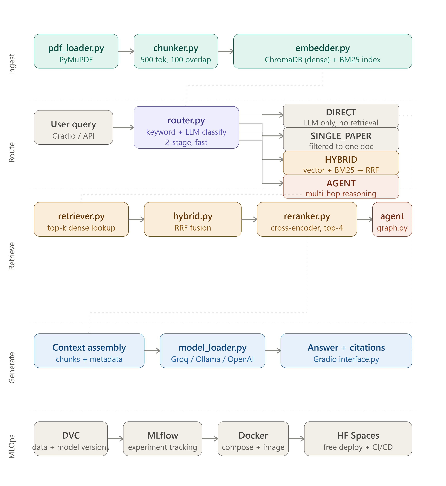

# Research Companion

An AI system that lets you query across multiple research papers using a query router, hybrid search (vector + BM25), cross-encoder re-ranking, and a reasoning agent layer. Built with near-zero cost using open-source models.

## What It Does

Drop in research PDFs → ask a question → the router picks the right strategy → get an answer with source citations.

## Architecture



<!-- Replace docs/architecture.png with a screenshot of the interactive diagram. -->

## Stack

| Component        | Library                              | Cost            |
|------------------|--------------------------------------|-----------------|
| Package manager  | uv                                   | free            |
| PDF extraction   | PyMuPDF                              | free            |
| Embeddings       | sentence-transformers (MiniLM-L6-v2) | free, CPU       |
| Vector DB        | ChromaDB                             | free, local     |
| Keyword search   | rank-bm25                            | free, local     |
| Re-ranking       | cross-encoder/ms-marco-MiniLM-L-6-v2 | free, CPU       |
| Query router     | custom (keyword + LLM)               | free            |
| LLM              | Groq (free) / Ollama (local) / OpenAI| switchable      |
| Agent            | LangGraph                            | free            |
| Evaluation       | RAGAS                                | free            |
| MLOps            | MLflow + DVC (Google Drive remote)   | free            |
| Deploy           | Hugging Face Spaces                  | free            |

## Setup

### 1. Install uv (once, globally)

```powershell
# Windows
powershell -ExecutionPolicy ByPass -c "irm https://astral.sh/uv/install.ps1 | iex"
```

```bash
# Mac/Linux
curl -LsSf https://astral.sh/uv/install.sh | sh
```

### 2. Clone and install

```bash
git clone https://github.com/YOUR_USERNAME/research-companion.git
cd research-companion

# Creates .venv, installs Python 3.11, installs phase 1 deps
uv sync --extra phase1
```

### 3. Configure environment

```bash
copy .env.example .env        # Windows
cp .env.example .env          # Mac/Linux
# Edit .env — set LLM_PROVIDER and the matching API key
```

**Quickest start (no GPU, free):** Set `LLM_PROVIDER=groq` and get a free key at [console.groq.com](https://console.groq.com).

**Fully local:** Set `LLM_PROVIDER=ollama`, install [Ollama](https://ollama.com), then `ollama pull mistral`.

### 4. Verify setup

```bash
uv run python -m src.llm.model_loader
# Should print: LLM connection successful.
```

### 5. Add papers and run

```bash
# Drop PDFs into data/raw/
uv run python main.py
```

## Project Structure

```
research-companion/
├── data/
│   ├── raw/                ← drop PDFs here
│   ├── processed/          ← extracted text  (DVC tracked)
│   └── chunks/             ← chunked docs    (DVC tracked)
├── embeddings/             ← ChromaDB persistent store
├── indexes/                ← BM25 index files
├── src/
│   ├── ingestion/
│   │   ├── pdf_loader.py   ← PDF → PDFDocument (PyMuPDF)
│   │   └── chunker.py      ← PDFDocument → List[Chunk]
│   ├── embeddings/
│   │   └── embedder.py     ← chunks → ChromaDB + BM25 index
│   ├── retrieval/
│   │   ├── router.py       ← query → Route (DIRECT/SINGLE_PAPER/HYBRID/AGENT)
│   │   ├── retriever.py    ← query → top-k chunks
│   │   ├── hybrid.py       ← vector + BM25 → RRF fusion
│   │   └── reranker.py     ← cross-encoder re-ranking
│   ├── llm/
│   │   └── model_loader.py ← Groq / Ollama / OpenAI switcher
│   ├── agent/
│   │   ├── tools.py        ← search_papers, summarize_paper
│   │   └── graph.py        ← LangGraph ReAct agent
│   └── app/
│       └── interface.py    ← Gradio UI
├── evaluation/             ← RAGAS eval scripts
├── finetuning/             ← QLoRA training (phase 4)
├── mlops/                  ← MLflow + DVC config
├── tests/                  ← pytest test suite
├── .github/workflows/      ← CI (eval on every push)
├── pyproject.toml          ← dependencies (uv)
├── config.py               ← all settings, reads from .env
└── main.py                 ← entry point
```

## Build Phases

| Phase | Weeks | Focus | Status |
|-------|-------|-------|--------|
| 1 | 1–2 | Core RAG — ingestion, embeddings, retrieval, Gradio UI | 🔨 in progress |
| 2 | 3   | Hybrid search — BM25 + vector, RRF, cross-encoder re-ranking | ⬜ upcoming |
| 3 | 4   | Query router (full LLM classify) + LangGraph agent | ⬜ upcoming |
| 4 | 5–6 | QLoRA fine-tuning + RAGAS evaluation | ⬜ upcoming |
| 5 | 7   | MLflow experiment tracking + DVC versioning | ⬜ upcoming |
| 6 | 8   | Docker + Hugging Face Spaces + CI/CD | ⬜ upcoming |

## How the Router Works

Every query is classified before any retrieval runs:

| Route | When triggered | Example query |
|-------|----------------|---------------|
| `DIRECT` | General knowledge, no paper context needed | "What is attention?" |
| `SINGLE_PAPER` | Asks about one specific named paper | "Summarise the BERT paper" |
| `HYBRID` | Cross-paper search (default) | "What techniques exist for positional encoding?" |
| `AGENT` | Comparison or multi-step reasoning | "Compare BERT vs GPT-2 architectures" |

Stage 1 — keyword heuristics (instant, no API call). Stage 2 — LLM classification for ambiguous queries (Phase 3).

## Switching LLM Providers

Edit `.env` — no code changes needed:

```bash
# Free, fast, no GPU needed
LLM_PROVIDER=groq
LLM_MODEL=llama-3.1-8b-instant

# Fully local, no API key
LLM_PROVIDER=ollama
LLM_MODEL=mistral

# Best quality (paid)
LLM_PROVIDER=openai
LLM_MODEL=gpt-4o-mini
```

## Daily Development

```bash
uv run python main.py                                    # run app
uv run python -m src.ingestion.pdf_loader data/raw/x.pdf # test loader
uv run python -m src.retrieval.router                    # test router
uv run pytest tests/                                     # run tests
uv add some-package                                      # add dependency
uv sync                                                  # install all phases
```
